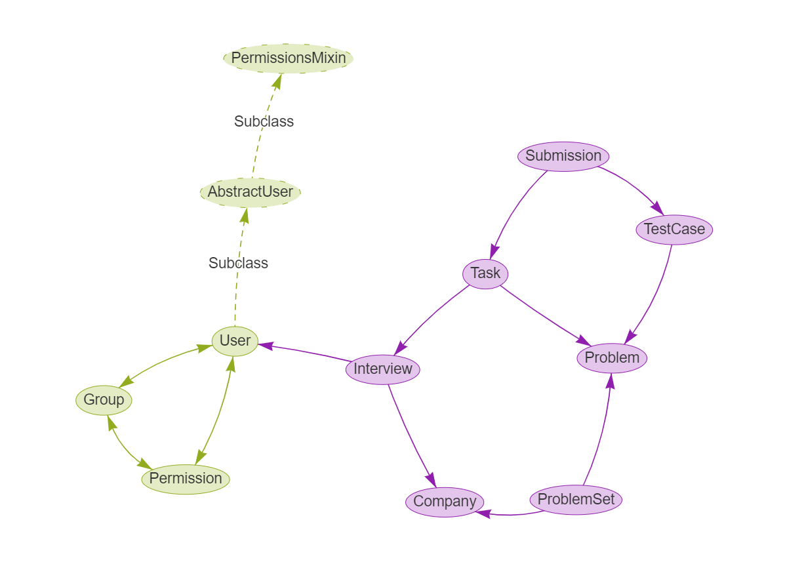

# interview-backend


An experimental implementation for "mock interview" GraphQL backend
based on Django.

## Database Design



There are four basically independent tables.
- `User` in `django.contrib.auth.models`.
- `Company`,
- `Problem`, which includes problem texts and its code templates,
    - `TestCase`, multiple cases for single problem.

And tables denote relationships between those.
- `Interview`, interview sessions and histories for users;
- `Task`, couple tasks are randomly selected for an interview;
- `Submission`, code for a task submitted from users and its judgement
results respectively.

Each company has a set of problems, which is placed in `ProblemSet`.

The `currentInterview` for a user will be stored into Redis cache w/ large TTL.
It will not harm the integrity when accidental data loss happens.

## Workflow Design

### When Starting an Interview

When a new interview is created, it will fetch `ProblemSet` for corresponding
`Company` and create N-`Task` linking to N-`Problem`
and 1-`Interview`.

### When Code Submitted

An online-judge task will be emit into Celery. `Submission` is saved
into database with newly assigned Celery `task_id`, leaving the judgement state
unknown. The backend will yield back to user immediately.

Querying the state returns "JUDGING" if Celery `task_id` still available, and
returns "UNKNOWN" if it cannot be found in Celery anymore,
possibly because of data loss.

After the task is completed, the result will be saved into Redis. But the state
of `Submission` leaves as-is. It will be applied to `Submission` in the next
frontend polling or `finishInterview`. By default, `result_expires`
in Celery configuration is 1 day.

### When the Interview Ends

All submission status of interviews are keep as-is, regardless of
historical interviews or the ongoing one. Frontend should explicitly
call `mutation finishInterview` after the interview expired. Otherwise 
the `query currentInterview` will keep in cache but no code can be submitted
due to backend validation on `expired_time`. `mutation finishInterview`
is essentially the checkpoint to clear the Redis `query currentInterview`
status, confirm all pending `Submission` and set
the `finished_time` of interview.

## Consequences of Data Loss

### When Redis Restarted Accidentally

- *Ongoing* interviews terminated w/o a `finished_time`.
- *Pending* judgements of submissions will be lost. Users may see
an "UNKNOWN" result of certain submission.

## TODO

- [x] Designing models and workflow
- [ ] GraphQL schema
    - [x] permission validation & account entry points
    - [x] `currentUser { interviewSet {...} }`
    - [x] `mutation startInterview`
    - [x] `currentInterview { taskSet { submissionSet {...} } }`
    - [ ] `mutation submitTask`
    - [x] `mutation finishInterview`
- [ ] Task dispatcher (django-celery)
- [ ] Migrating from SQLite to MySQL
- [ ] Migrating from LocMem to Redis
- [x] Deploying CI tests

## Scriptlets

```shell
sudo pip3 install virtualenv
virtualenv venv
source venv/bin/activate

pip3 install -r requirements.txt -i https://pypi.tuna.tsinghua.edu.cn/simple
python3 manage.py migrate
python3 manage.py createsuperuser
python3 manage.py runserver

# http://127.0.0.1:8000/admin/
# http://127.0.0.1:8000/account/login/
# http://127.0.0.1:8000/account/logout/
# http://127.0.0.1:8000/schema/
# http://127.0.0.1:8000/graphql/

python3 manage.py test
```
